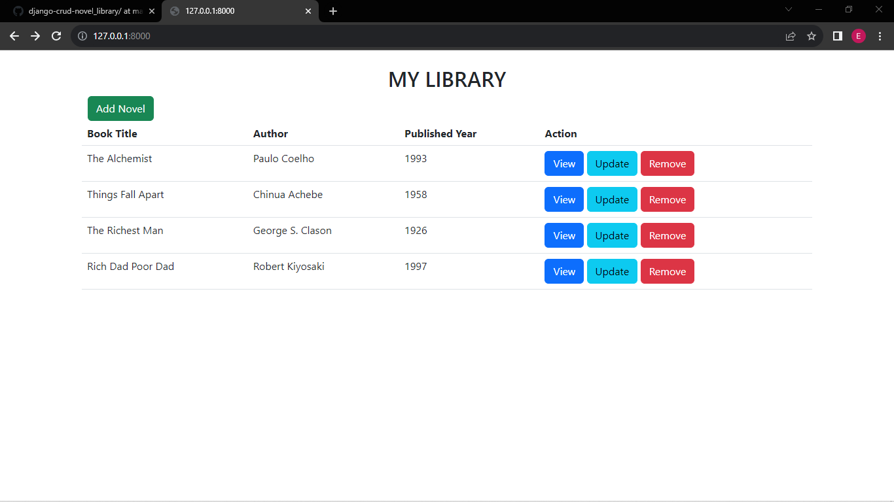
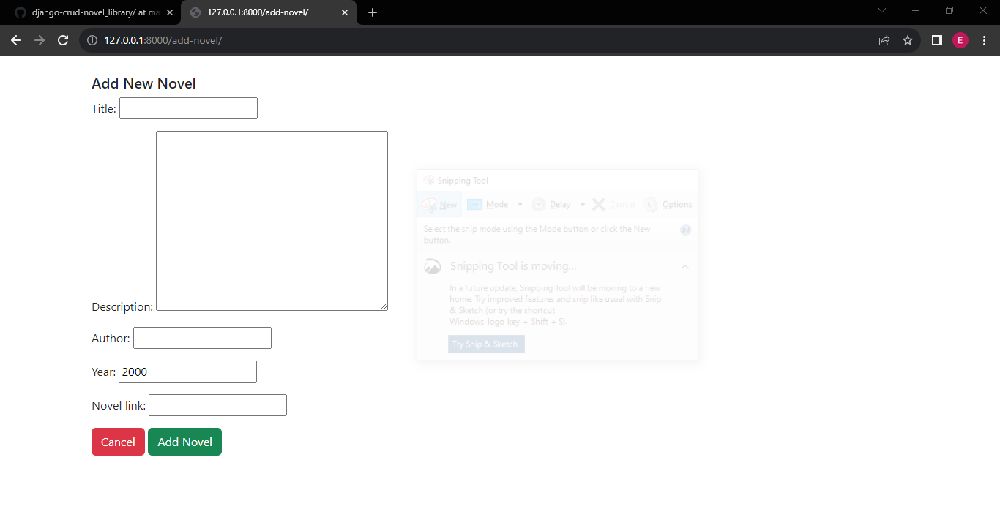
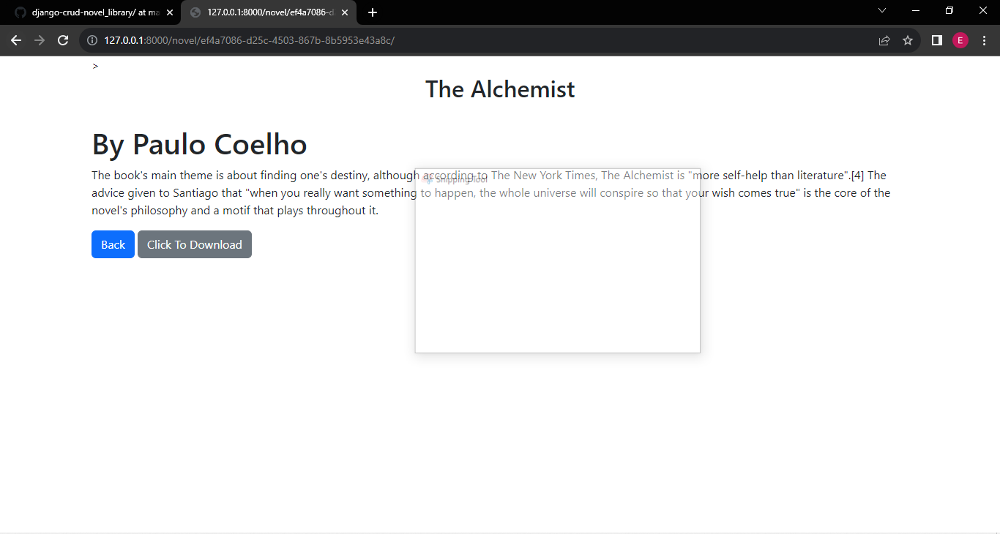
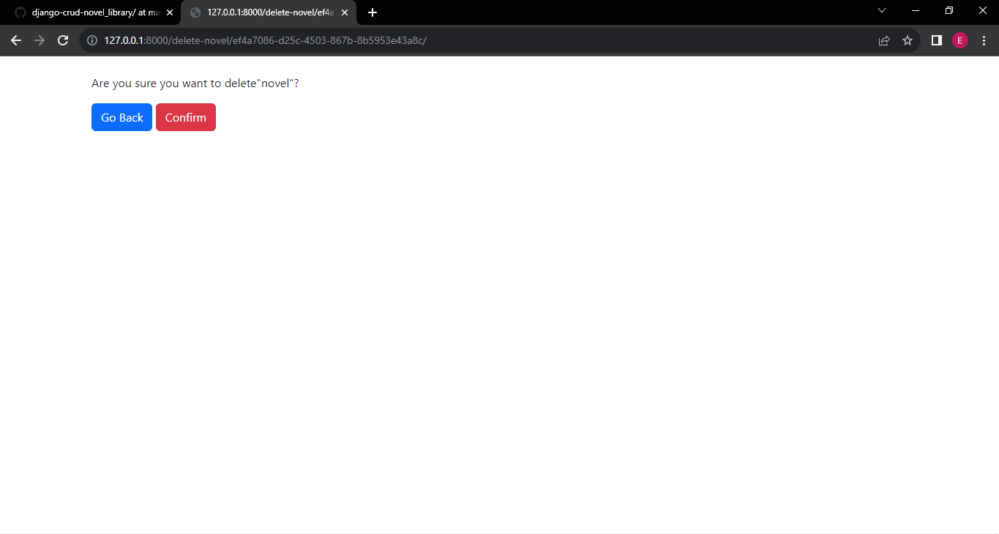

# django-crud-novel_library
Novel App is a django app is used to display novels, showing their names, authors, year of publication.
Users can read brief summary of the novel, they can also be redirected to where they can dowload the novel.

- Screenshots
  

